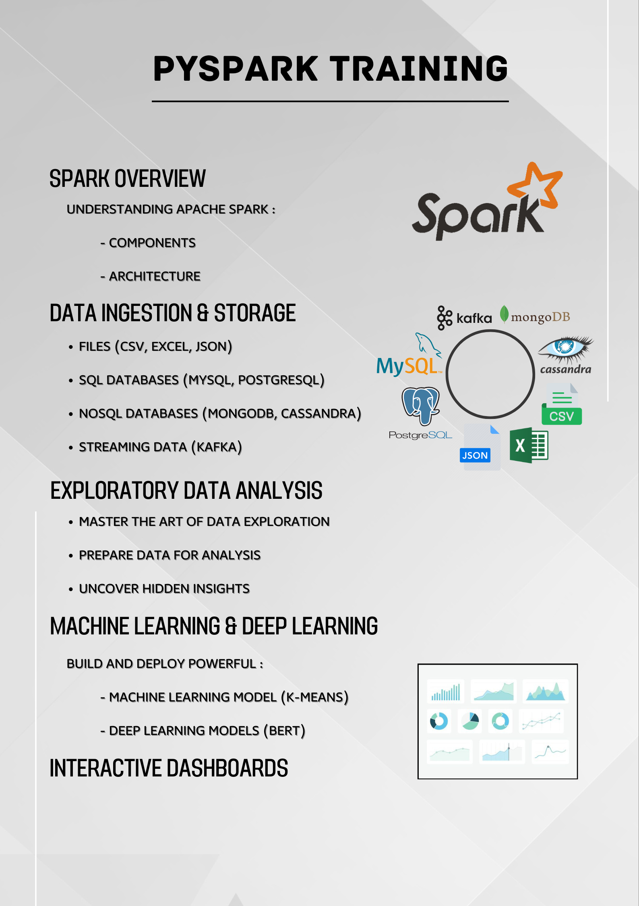

# PySpark Training

Welcome to the PySpark Training repository. This repository contains all the necessary materials and resources for mastering Apache Spark with PySpark. The training is divided into several parts, each focusing on different aspects of Spark and its applications.

## Training Modules

### Part 0: Spark Overview
- **File:** [part_0.pdf](./pdf/part_0.pdf)
- **Description:** Understanding Apache Spark: 
  - Components
  - Architecture

### Part 1 & Part 4: Data Ingestion & Storage
- **Files:** [part_1.pdf](./pdf/part_1.pdf) and [part_4.pdf](./pdf/part_4.pdf)
- **Description:** Learn how to ingest and store data using Spark.
  - Files (CSV, Excel, JSON)
  - SQL Databases (MySQL, PostgreSQL)
  - NoSQL Databases (MongoDB, Cassandra)
  - Streaming Data (Kafka)

### Part 2: Exploratory Data Analysis
- **File:** [part_2.pdf](./pdf/part_2.pdf)
- **Description:** Master the art of data exploration.
  - Prepare data for analysis
  - Uncover hidden insights

### Part 3: Machine Learning & Deep Learning
- **File:** [part_3.pdf](./pdf/part_3.pdf)
- **Description:** Build and deploy powerful machine learning and deep learning models.
  - Machine Learning Model (K-means)
  - Deep Learning Models (BERT)

## Interactive Dashboards
- **Description:** Learn how to create interactive dashboards to visualize your data insights effectively.

## Prerequisites

- Basic knowledge of Python programming
- Familiarity with SQL
- Understanding of machine learning concepts